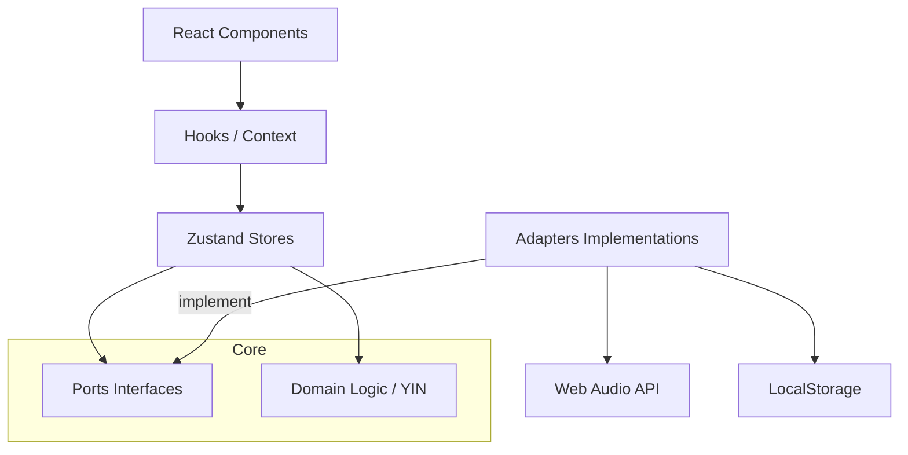

# Arquitectura Técnica: Violin Mentor

Este proyecto utiliza una **Arquitectura Hexagonal** (Ports & Adapters) para desacoplar la lógica de negocio (detección de pitch, análisis técnico) de las APIs del navegador (Web Audio API, localStorage, DOM).

## 🏗️ Capas del Sistema

### 1. Dominio (`lib/domain`)
- **Responsabilidad**: Reglas de negocio puras.
- **Contenido**: Tipos de datos, validaciones con Zod, algoritmos matemáticos (ej. YIN).
- **Dependencias**: Ninguna. No conoce el navegador ni React.

### 2. Puertos (Ports) (`lib/ports`)
- **Responsabilidad**: Definir interfaces para servicios externos.
- **Ejemplos**:
  - `AudioPort`: Métodos para iniciar/detener captura de audio.
  - `StoragePort`: Métodos para persistir sesiones.

### 3. Adaptadores (Adapters) (`lib/adapters`)
- **Responsabilidad**: Implementar las interfaces de los puertos.
- **Ejemplos**:
  - `WebAudioAdapter`: Implementa `AudioPort` usando `getUserMedia` y `AudioContext`.
  - `LocalStorageAdapter`: Implementa `StoragePort` usando la API de almacenamiento local.

### 4. Capa de Aplicación (Application)
- **Responsabilidad**: Coordinar el flujo de datos.
- **Contenido**: Zustand stores (`stores/`), hooks personalizados (`hooks/`).

## 📊 Diagrama de Módulos (Mermaid)

## 🧠 Dónde Vive la Lógica vs. Efectos

| Tipo de Lógica | Ubicación Recomendada | Razón |
|----------------|-----------------------|-------|
| Cálculo de Pitch | `lib/domain/pitch` | Debe ser testeable unitariamente sin mocks de audio. |
| Manipulación de Audio | `lib/adapters/audio` | Es un efecto secundario que depende de la API del browser. |
| Gestión de Sesión | `stores/sessionStore` | Es el estado global que la UI necesita observar. |
| Renderizado OSMD | `components/SheetMusic` | Es puramente visual y depende del DOM. |

## 📏 Dependency-Cruiser Rules (Resumen)
- El `Domain` no puede importar nada de `Adapters` ni `Stores`.
- Los `Adapters` solo pueden ser importados en la fase de inicialización o vía Inyección de Dependencias.
- Los componentes de React no deben llamar directamente a APIs globales del navegador; deben pasar por un hook o store.

## ⚖️ Rationale
Elegimos esta arquitectura para permitir:
1. **Testing Fácil**: Podemos testear la lógica de afinación pasando arrays de números en lugar de streams de audio reales.
2. **Sustitución**: Si en el futuro migramos de `localStorage` a `IndexedDB`, solo cambiamos el `StorageAdapter`.
3. **Mantenibilidad**: Los límites claros (boundaries) evitan que el código se convierta en "spaghetti" reactivo.
