# Motor de Práctica (Practice Engine)

El `PracticeEngine` coordina el flujo de datos entre la captura de audio, la partitura y el feedback al usuario.

## 🔄 Pipeline de Eventos Async
El motor opera como un generador asíncrono que emite eventos de estado:
1. `NOTE_START`: Detectada una nueva frecuencia estable que coincide con la partitura.
2. `NOTE_UPDATE`: Información sobre la desviación (cents) y estabilidad de la nota actual.
3. `NOTE_END`: La nota ha dejado de sonar o se ha pasado a la siguiente.

## 📊 Diagrama de Flujo (Mermaid)

```mermaid
sequenceDiagram
    participant Mic as Micrófono
    participant Pitch as YIN Detector
    participant Engine as Practice Engine
    participant Store as Session Store
    participant UI as React / OSMD

    Mic->>Pitch: Audio Buffer
    Pitch->>Engine: Freq + Prob
    Engine->>Engine: Validar Estabilidad
    alt Nota Correcta
        Engine->>Store: UPDATE_PROGRESS
        Store->>UI: Highlight Note / Cursor
    else Desviación detectada
        Engine->>UI: Show Tuning Gauge
    end
```



## 🛑 Cancelación y Control
- **AbortSignal**: Todas las operaciones del pipeline aceptan un `AbortSignal` para permitir la cancelación inmediata cuando el usuario detiene la práctica.
- **Backpressure**: Si el procesamiento de una nota tarda más que el siguiente buffer de audio, el motor descarta los frames antiguos para priorizar el tiempo real.

## 🎼 Segmentación de Notas
Para evitar falsos positivos por ruido o "slides" (glissandos), el motor utiliza un algoritmo de segmentación:
- Requiere al menos **3 frames consecutivos** (aprox. 45ms) de la misma nota para disparar `NOTE_START`.
- Define una ventana de tolerancia de **+/- 10 cents** para considerar una nota como "perfectamente afinada".

## 🛠 Debugging del Engine
Puedes observar el flujo de eventos en tiempo real activando el logger:
```javascript
// En la consola del navegador
window.__PRACTICE_DEBUG__ = true;
```
Esto imprimirá cada cambio de estado y la latencia calculada entre el pitch detection y la actualización del store.
